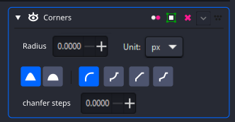
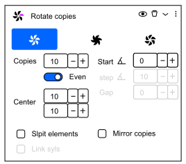
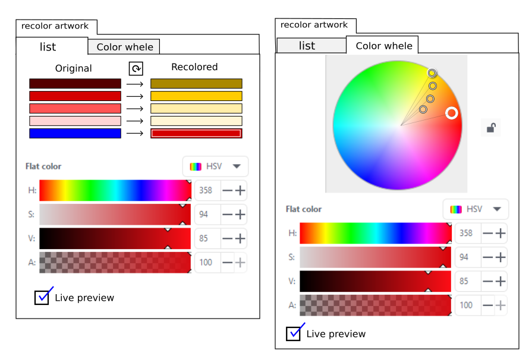
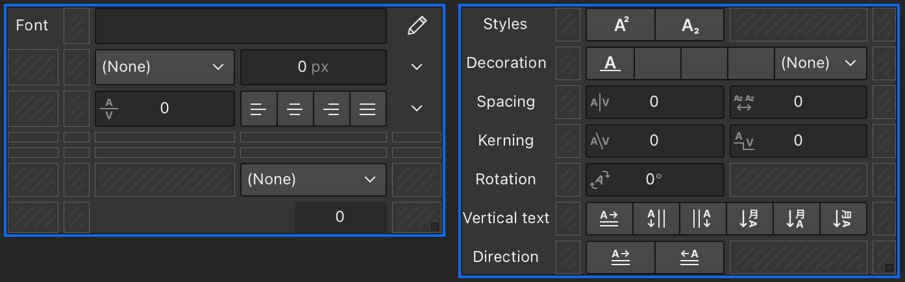

[Inkscape developer documentation](../readme.md) /

# Inkscape at Google Summer of Code

Welcome to Inkscape!

For quite a few years Inkscape has been successfully participating in
[Google Summer of Code](http://code.google.com/soc/).

Google has opened up the program to students AND beginners to Open
Source who are 18 years are older. Projects can be small (~90 hours),
medium size (~175 hours) or large size (~350 hours). Finish times 
are flexible, 12 to 22 weeks (with agreement of mentor).

For more information, checkout 
[Google's guide](https://google.github.io/gsocguides/mentor/).

GSoC is a program where Google funds the development of specific
features in open source software by university students and others new to
open source.
Projects to be developed are picked by Inkscape administrators from the
pool of proposals submitted by applicants.

We've mentored about 4-6 students a year since GSoC started.
Many students enjoyed their work and continue to be involved; perhaps
your mentor will be a past GSoC student! A lot of exiting new features
have been originally developed by GSoC students in the past
several releases.

**You're interested in joining us for the next round as a student? Great!**
Scroll through the ideas list below to get inspired and when the time
comes, talk to us and select a project of your choosing.

You can select a proposal from the list below or come up with one of your 
own. In either either case, you **must**
give us a detailed outline of what you plan to do. It is **highly**
recommended that you discuss your idea as early as possible with
Inkscape developers. They not only can give you guidance as you flesh
out your proposal but ultimately you must convince them that you can do
the work planned in the time allotted. **If you have not discussed your
proposal with Inkscape developers before you apply, your application
will be rejected!**

# Candidate Applications {#candidate_applications}

-   Google program information:
    -   [Home page](https://summerofcode.withgoogle.com/).
    -   Summer of Code Application form. Applications open at 18:00 UTC
        on March 18th, 2024.
        <https://developers.google.com/open-source/gsoc/timeline>

-   Inkscape-specific information:
    -   [SOC Application Template](application_template.md).

**Candidate Applications for GSoC 2024 must be submitted to the GSoC
site by 18:00 UTC on April 2nd 2024.**

# The "two patches" rule

We require two **relevant** previous contributions from each potential 
GSoC student **at the time of the application deadline** before
accepting the student for GSoC participation. 

The reason for this requirement is that you can show us that you have
 - succeeded in building Inkscape or set up the development environment
for the subproject you intend to work on on your PC
  - have understood a little piece of the code relevant for your project
    and are able to improve it.

Inkscape is a large project, and you really should not try to understand all the
code. Many (all?) developers know only parts of the program code! You
can join our or [chat](https://chat.inkscape.org/channel/team_devel) and ask
developers for help.

## Suggested "easy" bug fixes or improvements

To get you started on Inkscape development, you can find (probably)
easy-to-fix bugs or small improvements that require very little
knowledge of the whole program by searching our
[bug-tracker](https://gitlab.com/inkscape/inkscape/issues/) for bugs
tagged with \'easy-fix\'.

Note that for projects outside of the core repository (such as extensions,
website, infrastructure or documentation / translation infrastructure) 
related projects, your two patches should be in the appropriate subprojects
and programming language.

# Performance Evaluation

See also the [official guide](https://google.github.io/gsocguides/student/evaluations).

GSoC has two formal evaluation points, at the *mid-term* and at the end.
These evaluations determine if you receive the stipend from Google. In
order to receive a pass for the evaluations you will need to show
adequate progress toward your project\'s goals.

To help you meet your goals and so that your mentor can better evaluate
your progress you should:

-   Have frequent, public discussions of your progress. (Don't rely on
    just your mentor for advice)
-   Have a public branch for your code to which you commit
    regularly. Ideally, an open merge request invites discussion from
    other experienced contributors.
-   Give regular (typically weekly) status reports to the entire project.

For the final pass, the code doesn't need to be merged yet, but as a 
general guideline, there should be a clear pathway to get it 
production-ready (in particular, remarks from core contributors should 
have been addressed).

Remember: *we want you to succeed!*

# Suggested Project Ideas

The following is a list of formal project suggestions, but do not feel
limited to only these - some of our best contributions have been unique
ideas that students had in mind from other sources! That's how most 
developers start contributing - an "itch to scratch" is the best 
motivation to stay on track!

General inspiration may be taken from
 - [highly requested features](https://gitlab.com/inkscape/inbox/-/issues/?sort=popularity&state=opened&label_name%5B%5D=feature%20request&first_page_size=20)
 - [UX bugtracker](https://gitlab.com/inkscape/ux/-/issues/)

Older, possibly outdated project lists (definitely ask on 
[chat](https://chat.inkscape.org/channel/team_devel) before spending
any time on investigating them): 
 - [Development Project
Ideas](https://wiki.inkscape.org/wiki/Development_Project_Ideas)
 - [Projects](https://wiki.inkscape.org/wiki/Projects)
 - [Launchpad blueprints](https://blueprints.launchpad.net/inkscape/)

## C++ projects

### UI-Free Inkscape

-   Estimation of difficulty: Difficult - Long (350h)
-   Potential mentors: Marc Jeanmougin
-   Programming skills: C++, CMake
-   Prerequisites: Minimal knowledge of build systems. Experience with
    GtkMM helpful.

**Detailed Description:** Inkscape currently builds
with X11 and gtk and a lot of graphical dependencies. But since it is
allowed to run in commandline, and there are controlled environments
(servers) that use it to convert svg to png and to perform actions,
there should be no need to force it to build with those. The main goal
of this project is to add a WITH_GUI compilation flag that when OFF,
does **not** link Inkscape with any graphical dependency. While much
work has been done towards this goal, much remains to be done. 
More work needs to be done to separate out hidden GUI dependencies that
remain since the Verb to Action transition.

**Use cases**: Server installs, scripts

### Rework Live (Path) Effect system

-   Estimation of difficulty: Hard - Long (350h)
-   Potential mentors: mikekov
-   Programming skills: C++
-   Prerequisites: experience with raster images

**Detailed Description:** Live Path Effects (LPEs) are non-destructive effects applied to paths and shapes 
standalone or inside a group.
This is done by keeping a reference to the original data to recompute when
needed.
Currently, they don't work on text and image elements, and the underlying
code needs to be refactored to support this and make LPEs more robust.

**Use cases:** Enable non-destructive editing for more object types, even
groups with mixed element types. 

### Path Library Improvements 

-   Estimation of difficulty: Hard - Long (350h)
-   Potential mentors: Tavmjong Bah
-   Programming skills: C++
-   Prerequisites: Strong math skills, specifically in (computational) geometry.

**Detailed Description:** Inkscape relies on two
geometry libraries for path manipulations: lib2geom and livarot.
lib2geom is a generic modern library written specifically with Inkscape
in mind. lib2geom is missing some functionality that Inkscape requires
and that is found in livarot. This project is to move that functionality
into lib2geom (or into separate files) using lib2geom path descriptions.
A 2020 GSoC student did a significant amount of work understanding and
documenting the issues involved. This project would be to build on his
work.

Specifically, the functionality needed is

-   Path offset/inset functions.
-   Path simplify.
-   Stroke to path function.
-   Line scanning (used for flowing text into a shape).

### Improvements to Fill and Stroke Dialog

-   Difficulty: Medium
-   Prerequisites: Some knowledge of GTK and CSS.

F&S dialog "bakes in" all object styles into inline style upon editing anything.
Changing one attribute (say fill) should not impact other attributes (like stroke).
With this groundwork done we would be better positioned to handle CSS classes.
Today CSS styles get merged into inline style. F&S should understand that attributes can
be coming from CSS classes and not override them unless users expressly edit them.

###  Improving UI of Live path effects

-   Estimation of difficulty: Medium-Hard, Medium or Long depending on
    scope (175h or 350h)
-   Potential mentors: Mike
-   Programming skills: GTK 4, C++
-   Prerequisites: Front end UI, familiarity with Live path effects

**Detailed Description:** This project should
implement the proposed UI clean up of controls. LPE controls should be
more user friendly and predictive. [**Full Proposed
designs**](https://gitlab.com/inkscape/ux/-/issues/?sort=popularity&state=opened&label_name%5B%5D=Dialog%3A%3ALPE&first_page_size=100)

| Corners LPE    | Rotate copies LPE |
| -------- | ------- |
|   |      |

<!-- This dialog has been implemented.

###  Recolor Artwork 

-   Estimation of difficulty: Variable - Short to Medium (90h or 175h)
-   Potential mentors: Adam Belis ?
-   Programming skills: C++
-   Prerequisites:

**Detailed Description:** An easy and convenient way
how to change any color from the selection. Useful for experimenting and
tweaking colors.

[**Full proposal
Here**](https://gitlab.com/inkscape/inbox/-/issues/6095)

**Use cases**

-   fast editing of color in whole project without the need for swatches
-   easier way to make colors harmonize in a project
-   Faster iteration and visioning of designs

-->

###  OpenType font generation

-   Estimation of difficulty: Medium
-   Potential mentors:
-   Programming skills: C++

Inkscape supports creating and editing SVG fonts. Since SVG fonts have been deprecated, it would increase relevance of this feature if users could generate OpenType font from SVG font.
Using dedicated library (like `otfcc`) one could feed all glyphs and metadata to create OpenType CFF font with cubic bezier glyphs.

In addition to regular OTF fonts, we could also create color fonts. Users design fonts in Inkscape working with SVG, and one flavor of OpenType color fonts supports subset of SVG. It would make for a very convenient tool if we could export color fonts directly from Inkscape.

###  Settings dialog redesign

-   Estimation of difficulty: Medium to hard
-   Potential mentors:
-   Programming skills: C++

Inkscape has several proposals for improved settings dialog (check Henrique's designs: https://gitlab.com/inkscape/ux/-/issues/276). We need help in translating designs into a code. Here's one such attempt: https://gitlab.com/inkscape/inkscape/-/merge_requests/6980

Design files for settings dialog: https://www.figma.com/design/aOK3tJin11sUgPk9UqFyj2/Inkscape---UI-specs?node-id=3007-22846&p=f

### Text object properties

-   Estimation of difficulty: Medium to hard
-   Potential mentors:
-   Programming skills: C++

Object properties dialog supports several element types, but lacks support for text. Unlike other elements, text support requires UI to listen to "subselection" changes (that is cursor position) to update text properties.

Possible design (WIP):

This project requires some refactoring to share logic with a text toolbar.

### ~~On-canvas spell checking~~

Note: This project has been started. https://gitlab.com/inkscape/inkscape/-/merge_requests/7297

Note: This task is stalled due to https://gitlab.com/inkscape/inbox/-/issues/8524

-   Estimation of difficulty: Variable - Short or Medium (90h or 175h)
-   Potential mentors: Tavmjong, ?
-   Programming skills: C++
-   Prerequisites: Some knowledge of GTK. Ability to work with UI designers.
 
**Detailed Description:** Currently one can spell-check text via either using
a dedicated `Check Spelling` dialog or using the `Text` tab of the `Text and Font`
dialog. Neither are ideal solutions. In particular, using the `Text` tab can
remove style information.

This project would be to flag misspelled words on the canvas. It requires:

-   Enabling/disabling.
-   Selecting language(s).
-   A visual indicator of suspected misspelled words.
-   A pop-up to display and select alternative spellings (or to set an ignore flag).

A successful proposal would include a UI plan worked out ahead of time with the UI team.

## Python projects

### Import and Export extensions

-   Estimation of difficulty: Flexible, usually easy to medium, Medium or
    Long depending on scope (175h or 350h)
-   Potential mentors: Jonathan
-   Programming skills: Python, Ability to read technical documents,
    depending on the format: some reverse engineering
-   Prerequisites: minimal knowledge of test-driven development

**Detailed Description:** Inkscape is always looking
to improve compatibility! Some ideas of relevant file formats - each of
them more than enough for one GSoC:

- Refactor our **DXF input and output** extensions, and improve their test coverage / correctness
-   Rewrite the **XAML importer** in Python (currently XSLT) to match the
    capabilities of the new XAML exporter (i.e. support for different
    target frameworks, better text support...) - would have to select
    carefully what to support (drawing primitives) and what not (control
    elements) - the boundary is not as clear-cut as it seems.
-   Update the **Synfig export** to support the latest Synfig
    developments
-   **Import or export of TikZ**. There are a few abandoned extensions
    out there (from which we can borrow), but it\'s very widely used in
    science - both import and export could serve an important function
    in the scientific workflow. Related, import / export to **Typst**.
-   **Import of the proprietary fileformats** of Vectornator (now Linearity Curve),
    Vectorstyler, Canva (users at some point will sit on a bunch of files that
    they can't open anymore because).
-   **Python based EMF / WMF importer -** the current (core Inkscape) C
    extension is unmaintained and Python would probably be the right way
    to get more collaboration on it. A lot of public archives sit on
    mountains of EMF files. Note that the Document Foundation recently
    did a lot of work properly importing those files, so we can learn
    from them / maybe even join forces ...
-   your favorite file format? - also have a look here:
    <https://office.inkscape.org/nextcloud/index.php/s/Tq6cdDDGay6taCw>

### Gcodetools refactoring and documentation 

-   Estimation of difficulty: Easy- Medium or Long depending on scope
    (175h or 350h)
-   Potential mentors: Jonathan
-   Programming skills: Python
-   Prerequisites: Maker background / familiarity with the Maker
    community

**Detailed Description:**
[Gcodetools](https://gitlab.com/inkscape/extras/extensions-gcodetools/)
is a set of Inkscape extensions that deal with reading and creating
Gcode files, mostly for use in laser cutters or plotters. For this
project, ideally someone with a Makerspace background will

1.  query maker spaces on their needs regarding gcodetools,
2.  implement those needs together with unit tests,
3.  improve the test coverage of Gcodetools,
4.  write proper documentation for it. (doesn\'t really exist at the
    moment).

## Packing / Nesting as an Inkscape extension

-   Estimation of difficulty: Medium, Short or Long depending on scope
    (175h or 350h)
-   Potential mentors: Jonathan
-   Programming skills: Python
-   Prerequisites: Computational geometry

**Detailed Description:** In this project, a set of
packing / nesting algorithms will be implemented:

-   [Linear
    nesting](https://en.wikipedia.org/wiki/Cutting_stock_problem) is not
    too useful in SVG, but might be a good place to get acquainted with
    the problem. 2D cutting stock problem would be very interesting to
    have and would work great with the new multipage functionality.
-   For efficient packing of free form objects, we might just
    re-implement [SVGNest](https://github.com/Jack000/SVGnest) in
    Python. There are probably some more recent research papers which
    would be interesting to implement as a comparison.

## Other

### Your project 

-   Estimation of difficulty: Variable - Variable (90h to 350h)
-   Potential mentors: ask us!
-   Programming skills: C++ or Python
-   Prerequisites: good ideas

**Detailed Description:** The most successful GSoC
we had in the past were students coming with their own past, use cases
and ideas for Inkscape. Many basic tools like 3d cubes or connectors you
can see in Inkscape now have been brought by brilliant people (like you)
with ideas. If we think that your project fits with Inkscape (ie: has
its place with a vector graphic editor), we can help you refining your
ideas and help bring shiny new stuff to life!

**Use cases**

-   Amaze us!

# Successful SOC Projects from Previous Years

-   2005
    -   Connectors
    -   Inkboard
    -   [Open Clip Art Library (OCAL)](http://www.openclipart.org/)
        Interface
    -   DXF Import / Export
-   [2006](https://wiki.inkscape.org/wiki/Google_Summer_of_Code_2006)
    -   Support for SVG Filters
    -   Filter Effects
    -   PDF export
    -   Inkboard Protocol Spec / Lib Conversion
-   [2007](https://wiki.inkscape.org/wiki/Google_Summer_of_Code_2007)
    -   Text Style Improvements
    -   PDF import
    -   Live Path Effects
    -   3D Box Tool
    -   UI for SVG Filter Effects
    -   Raster Functionality
    -   Importing from, and Exporting to, a remote ccHost instance
-   [2008](https://wiki.inkscape.org/wiki/Google_Summer_of_Code_2008)
    -   SVG Fonts support
    -   2Geom refactoring project - port most geometry code to 2Geom
    -   lib2geom: interactive applications showing off the power of
        lib2geom
    -   Tech drawing abilities
    -   A test suite
-   2009
    -   [Node tool rewrite](https://wiki.inkscape.org/wiki/GSoC2009_Node_Tool_Rewrite)
    -   D-Bus scripting API
    -   Connector tool improvements
    -   ICC/CMYK workflow
-   2010
    -   Cairo-based rendering
    -   C++ification of SP Layer
-   2011
    -   Rendering caching
    -   Javascript support improvements
    -   CSS support improvements
-   2012
    -   Usability Improvements for Guides
    -   [On-canvas support for Tessellations](https://wiki.inkscape.org/wiki/Tiling_tool)
    -   Creating python bindings for lib2geom
-   [2013](https://wiki.inkscape.org/wiki/Google_Summer_of_Code_2013)
    -   Recolor Tool
    -   Improved Units Support
    -   Electronics CAD Support
    -   New From Templates Dialog
    -   New Raster to Vector Algorithm
-   2014
    -   Better Support for SVG Paints
    -   Robust Boolean and Stroking Operations for 2Geom
-   2016
    -   [Better data structure for
        selections](https://summerofcode.withgoogle.com/archive/2016/projects/5726533045977088), see also [wiki page](https://wiki.inkscape.org/wiki/GSoC_2016_Better_data_structure_for_selections)
    -   [CSS Style Sheet Editor](https://summerofcode.withgoogle.com/archive/2016/projects/5444506165968896), see also [wiki page](https://wiki.inkscape.org/wiki/Style_Editor)
-   2017
    -   [SVG 2 Text Support](https://summerofcode.withgoogle.com/archive/2017/projects/6083005399433216)
    -   [Better CSS Style Sheet Support](https://summerofcode.withgoogle.com/archive/2017/projects/6239022099726336)
-   2019
    -   [Mesh gradient and hatches polyfills](https://summerofcode.withgoogle.com/archive/2019/projects/5511570182897664)
-   2020
    -   [New dialog
        system](https://summerofcode.withgoogle.com/archive/2020/projects/4532822624174080)
    -   [Command palette
        dialog](https://summerofcode.withgoogle.com/archive/2020/projects/6037740912640000)
    -   [Path operations documentation](https://summerofcode.withgoogle.com/archive/2020/projects/5898337749827584)
-   2021
    -   [On-canvas marker
        editing](https://summerofcode.withgoogle.com/archive/2021/projects/5240879656206336)
    -   [Verbs to
        Gio::Actions conversion](https://summerofcode.withgoogle.com/archive/2021/projects/4846462910857216)
    -   [On canvas alignment
        snapping](https://summerofcode.withgoogle.com/archive/2021/projects/5895585042792448)
    -  [On-canvas interactive boolean operations](https://summerofcode.withgoogle.com/archive/2021/projects/5473372577726464) - basis for the Shape builder Tool of Inkscape 1.2
    - [Website update to Django 2.x](https://summerofcode.withgoogle.com/archive/2021/projects/5491156258914304)
    - [Rework of Export dialog](https://summerofcode.withgoogle.com/archive/2021/projects/5205455034384384), shipped in Inkscape 1.2
-   2022
    -   [Tab
        Structure](https://summerofcode.withgoogle.com/archive/2022/projects/O3vqQRkr)
    -   [Font
        Selections Improvement](https://summerofcode.withgoogle.com/archive/2022/projects/PrGVjiXp)
    -   [OCR
        Support](https://summerofcode.withgoogle.com/archive/2022/projects/LcbNVGrj)
-   2023
    -   [GTK4 toolbar port
        preparation](https://summerofcode.withgoogle.com/archive/2023/projects/P8MnvcRk)
    -   [Customizable Appearance of Canvas
        Controls](https://summerofcode.withgoogle.com/archive/2023/projects/t7Xn0iW6) - shipped in Inkscape 1.4
-   2024
    - [Support for .afdesign files](https://summerofcode.withgoogle.com/programs/2024/projects/sR7nHXTJ), shipped in Inkscape 1.4
    - [Improving UX of Node and Bezier tools](https://summerofcode.withgoogle.com/programs/2024/projects/S22SNeiv)
    - [Node-based filter editing](https://summerofcode.withgoogle.com/programs/2024/projects/yvk2ZxIj)
